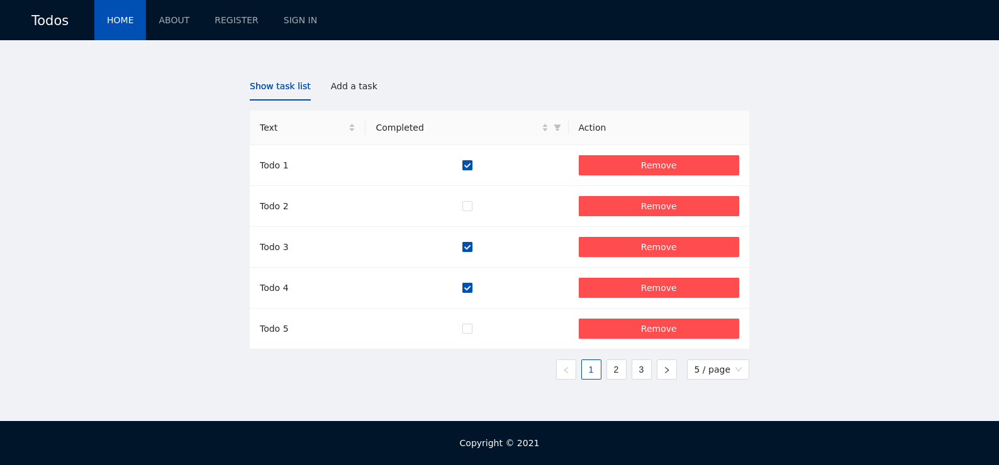

# next-todos

SSR web application for working with the task list.

The project uses React.js, (Hooks), Redux Toolkit (slices, thunks), Firebase (Firestore, Authentication), React Testing Library, Next.js, Ant Design, TypeScript.



## Setup

1. Install dependencies: `npm install`
2. Create a project and register app in Firebase Console
3. Create .env.local file. Fill in the example with your data. [Instruction for getting firebase settings](https://support.google.com/firebase/answer/7015592#zippy=%2Cin-this-article).

```env
FIREBASE_API_KEY=
FIREBASE_AUTH_DOMAIN=
FIREBASE_PROJECT_ID=
FIREBASE_STORAGE_BUCKET=
FIREBASE_MESSAGING_SENDER_ID=
FIREBASE_APP_ID=
FIREBASE_TODOS_COLLECTION=<collection name>
API_HOST=<website url>/api
```
